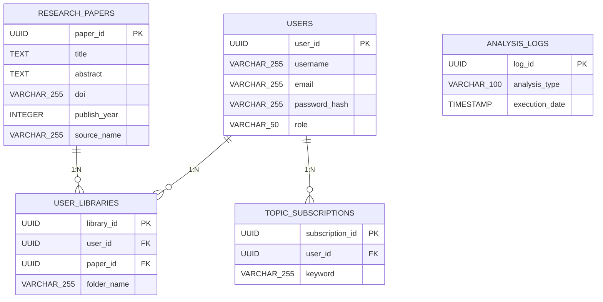

# Sơ đồ ER

Sơ đồ ER của Hệ thống Theo dõi Xu hướng Nghiên cứu Khoa học. Định nghĩa mối quan hệ giữa người dùng, luận văn, thư viện, cài đặt đăng ký và log phân tích.

### Danh sách Entity

**USERS**

| Tên cột | Kiểu dữ liệu | Khóa |
| --- | --- | --- |
| user_id | UUID | PK |
| username | VARCHAR(255) |  |
| email | VARCHAR(255) |  |
| password_hash | VARCHAR(255) |  |
| role | VARCHAR(50) |  |

**RESEARCH_PAPERS**

| Tên cột | Kiểu dữ liệu | Khóa |
| --- | --- | --- |
| paper_id | UUID | PK |
| title | TEXT |  |
| abstract | TEXT |  |
| doi | VARCHAR(255) |  |
| publish_year | INTEGER |  |
| source_name | VARCHAR(255) |  |

**USER_LIBRARIES**

| Tên cột | Kiểu dữ liệu | Khóa |
| --- | --- | --- |
| library_id | UUID | PK |
| user_id | UUID | FK |
| paper_id | UUID | FK |
| folder_name | VARCHAR(255) |  |

**TOPIC_SUBSCRIPTIONS**

| Tên cột | Kiểu dữ liệu | Khóa |
| --- | --- | --- |
| subscription_id | UUID | PK |
| user_id | UUID | FK |
| keyword | VARCHAR(255) |  |

**ANALYSIS_LOGS**

| Tên cột | Kiểu dữ liệu | Khóa |
| --- | --- | --- |
| log_id | UUID | PK |
| analysis_type | VARCHAR(100) |  |
| execution_date | TIMESTAMP |  |

### Quan hệ

- USERS → USER_LIBRARIES (1:N)
- RESEARCH_PAPERS → USER_LIBRARIES (1:N)
- USERS → TOPIC_SUBSCRIPTIONS (1:N)

### Sơ đồ ER

